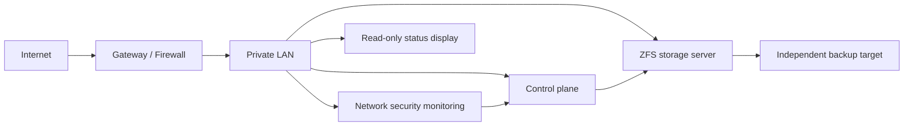

# Homelab

A security-first reference architecture for a small self-hosted environment. This repository documents patterns, decision records, runbooks, and sanitized examples—not live topology, credentials, or production configuration.

## Design principles

- Storage resilience before applications.
- Direct-disk access for ZFS; never hide disks behind hardware RAID virtual volumes.
- Management interfaces remain private.
- Monitoring produces actionable states, not vanity dashboards.
- Document recovery and test restores.
- Separate public examples from live operational details.

## Architecture

## Repository layout

- `docs/architecture.md` — component boundaries and trust model.
- `docs/storage.md` — ZFS-oriented storage design and acceptance checklist.
- `docs/monitoring.md` — actionable monitoring and alert design.
- `docs/security.md` — publication and operational-security rules.
- `examples/` — non-production templates only.

## Scope

This is a living technical portfolio. It intentionally omits:

- public IPs, LAN addressing, MAC addresses, hostnames, domains, or service URLs;
- router/firewall exports, port-forward rules, and live configuration;
- API keys, OAuth tokens, credentials, backups, telemetry, and device inventories.

See `SECURITY.md` before contributing.
